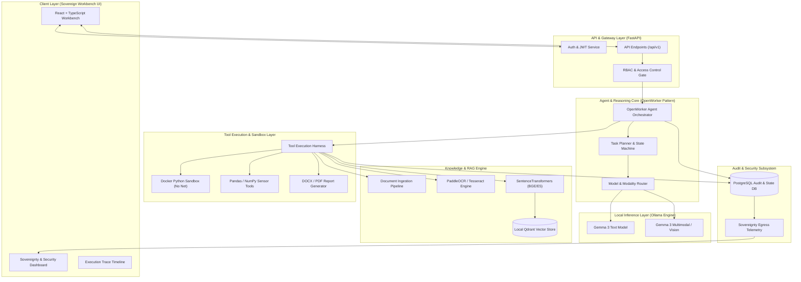

# Architecture Specification
## Sovereign On-Premise Agentic AI Workbench using Open-Weight Multimodal LLMs

### 1. Executive Summary & Design Principles

The **Sovereign On-Premise Agentic AI Workbench** is a enterprise-grade, privacy-first, fully offline decision-support platform designed for defense, manufacturing, industrial, and healthcare organizations handling highly confidential documents, sensor data, and intellectual property.

#### Fundamental Core Principles:
1. **100% Local & Sovereign**: Zero cloud AI APIs (no OpenAI, Gemini, Anthropic, or external OCR/embeddings).
2. **Offline-Capable**: Operates fully disconnected from the internet once local models and dependencies are loaded.
3. **Auditable & Explainable**: Every tool call, model prompt, document chunk, and routing decision is tracked in an immutable execution trace and audit log.
4. **Zero-Trust Input & Prompt Injection Defense**: Documents and tool outputs are treated as untrusted data inputs, strictly segregated from System Security Policies.
5. **Human-in-the-Loop & Tool Approval Gates**: High-risk tool calls require explicit authorization.
6. **Sandboxed Code Execution**: All Python data analysis runs inside isolated ephemeral Docker containers with network access disabled.

---

### 2. System Architecture Diagram



---

### 3. Repository Structure (Monorepo Blueprint)

```text
sovereign-ai-workbench/
├── backend/
│   ├── app/
│   │   ├── api/             # FastAPI routers (auth, tasks, docs, models, system)
│   │   ├── core/            # Config, security, database session, exceptions
│   │   ├── models/          # SQLAlchemy / Pydantic data models
│   │   ├── schemas/         # Request/Response validation schemas
│   │   ├── services/        # Business logic services
│   │   ├── agents/          # OpenWorker agent orchestrator, planner, policies
│   │   ├── tools/           # Tool registry (PDF, OCR, RAG, Python, Vision, Report)
│   │   ├── rag/             # Chunking, vector retrieval, permission filtering
│   │   ├── ocr/             # Local PaddleOCR wrapper & image preprocessing
│   │   ├── llm/             # LLMProvider abstraction & Ollama implementation
│   │   ├── router/          # ModelRouter & capability matrix
│   │   ├── security/        # JWT, RBAC, path traversal, injection defense
│   │   ├── audit/           # Audit logger & task event recorder
│   │   ├── sandbox/         # Docker Python sandbox launcher & runner
│   │   ├── reports/         # ReportLab / python-docx report builders
│   │   ├── storage/         # Local file storage manager
│   │   ├── monitoring/      # Prometheus metrics collector & sovereignty monitor
│   │   └── database/        # Alembic migrations & DB initializers
│   ├── tests/               # Unit, integration, sandbox, and RAG evaluation tests
│   ├── requirements.txt
│   └── main.py              # Application entrypoint
├── frontend/
│   ├── src/
│   │   ├── components/      # Reusable UI components (Navbar, Sidebar, Modals, Cards)
│   │   ├── pages/           # Workbench, Documents, ExecutionTrace, SovereigntyDash, Audit
│   │   ├── services/        # API client modules
│   │   ├── hooks/           # Custom React hooks (auth, tasks, trace)
│   │   ├── types/           # TypeScript interfaces & types
│   │   └── layouts/         # Page layout wrappers
│   ├── package.json
│   └── vite.config.ts
├── knowledge_base/
│   ├── documents/           # Raw synthetic industrial docs
│   ├── processed/           # OCR & extracted JSON artifacts
│   └── metadata/            # Metadata sidecars
├── sandbox/
│   ├── Dockerfile.sandbox   # Isolated Python execution image definition
│   └── runner.py            # Micro runner script inside container
├── docker/
│   ├── docker-compose.yml   # Multi-container local orchestration (Postgres, Qdrant, Prometheus, Grafana)
│   └── Dockerfile.backend   # Backend Docker image definition
├── docs/
│   ├── architecture.md
│   ├── implementation-plan.md
│   ├── setup.md
│   ├── security.md
│   └── api.md
├── scripts/                 # Setup, seed, and evaluation scripts
├── .env.example
├── README.md
└── task.md
```

---

### 4. Component Breakdown & Design

#### 4.1 Agent Orchestrator (OpenWorker Pattern)
Inspired by Andrew Ng's OpenWorker coworker architecture, the agent operates as a multi-step state machine:
1. **Objective Parsing**: Breaks down user input into structured steps.
2. **Context Assembly**: Queries knowledge base and files.
3. **Model Selection**: Chooses optimal local model via `ModelRouter`.
4. **Tool Discovery & Permission Verification**: Evaluates tool risk levels against user RBAC role.
5. **Execution & Feedback Loop**: Executes tool inside sandbox or service, evaluates response, and decides next step.
6. **Artifact Generation & Synthesis**: Produces final response and structured DOCX/PDF report.

#### 4.2 Local LLM & Vision Layer
- **Interface**: Abstract class `LLMProvider` defining `generate()`, `chat()`, `health()`.
- **Implementation**: `OllamaProvider` connecting to local Ollama instance running `gemma3`.
- **Multimodal**: Vision tasks route to vision-capable Gemma variants via base64 encoded local image payloads.

#### 4.3 Data Analysis & Docker Sandbox
- Python code execution runs in an isolated container created dynamically or via runner pool.
- Restrictions: `--net=none`, memory limit 512MB, CPU limit 1.0, read-only root FS, temporary mount point for CSV input and JSON output.

#### 4.4 RAG Engine with RBAC Security
- Document chunks store `department`, `classification`, `owner`, and `allowed_roles`.
- Queries automatically apply PostgreSQL/Qdrant metadata payload filters: `allowed_roles CONTAINS user.role`.

#### 4.5 Sovereignty & Monitoring Subsystem
- Real-time monitor tracks active socket connections and outbound HTTP traffic.
- Endpoint `/api/system/sovereignty` verifies 0 external cloud calls, providing visual verification on the Sovereignty Dashboard.
